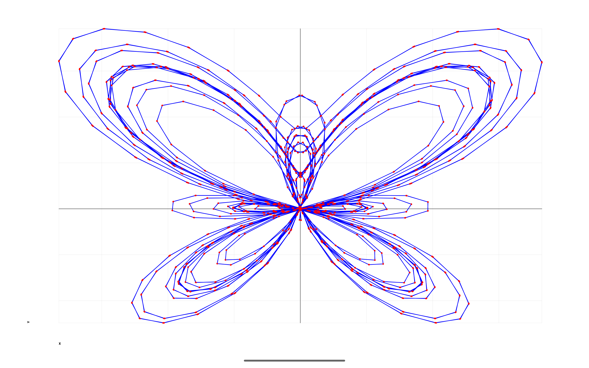
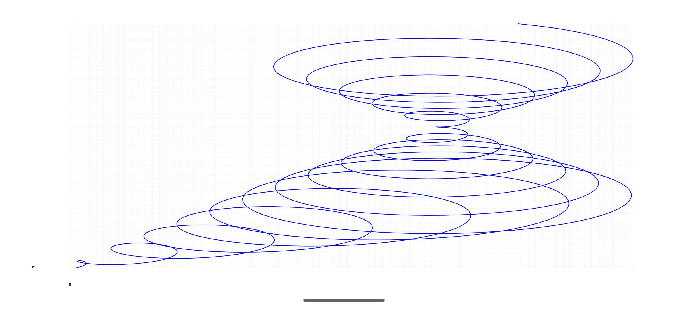
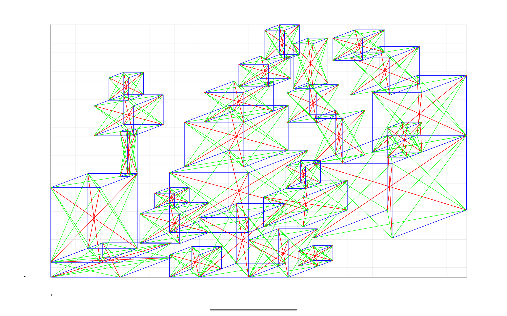
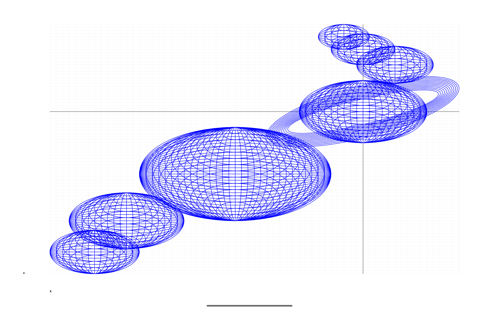
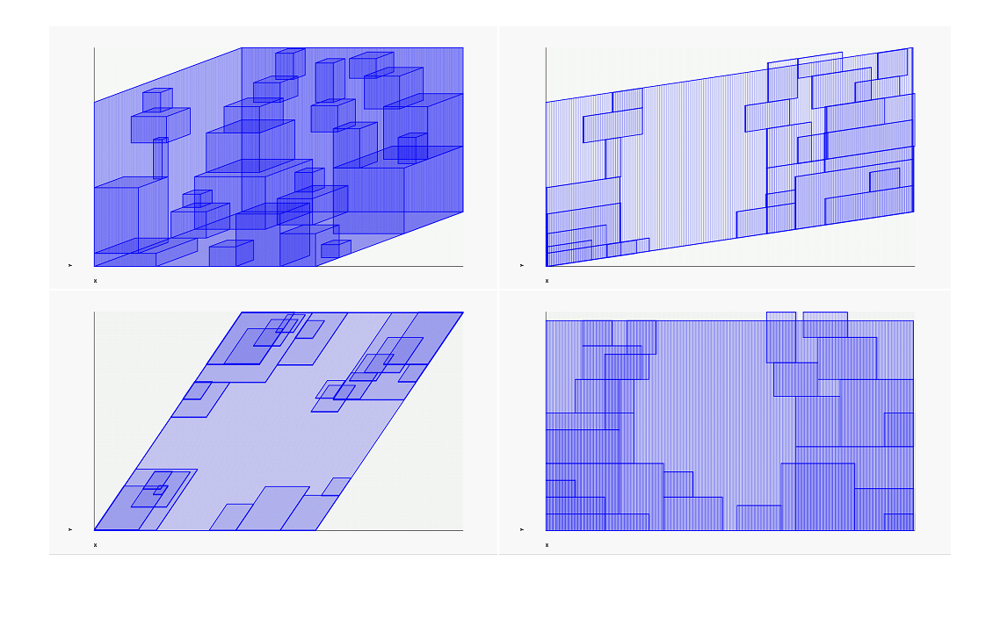
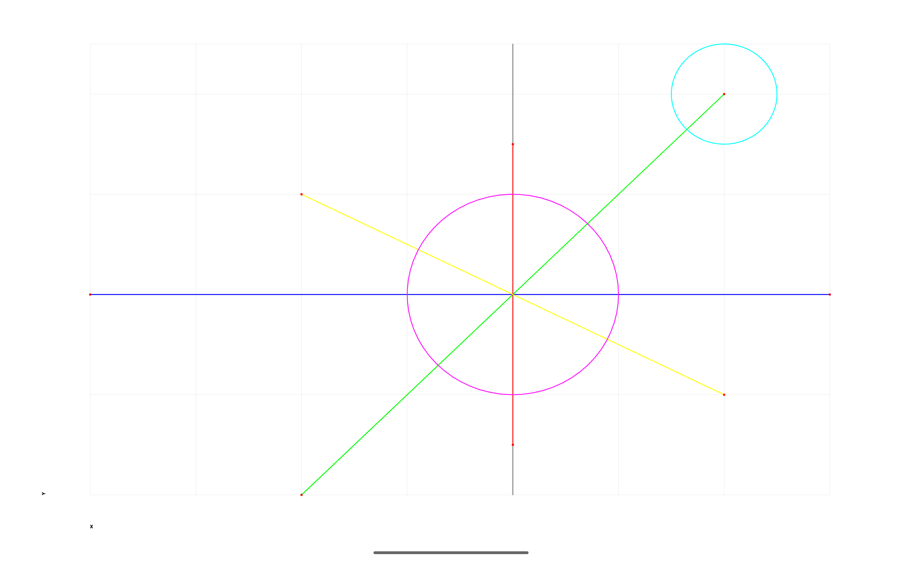
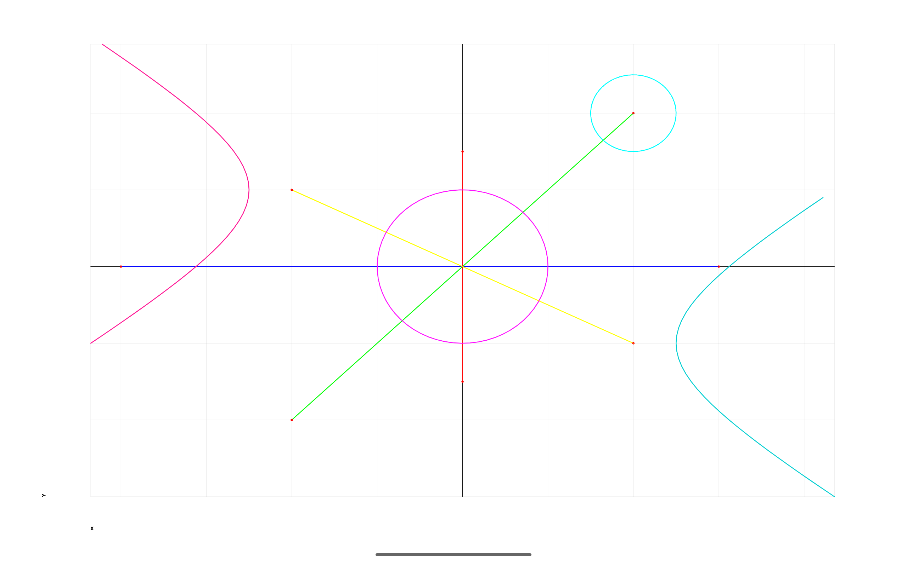

Android Graphs Experiments
==========================

Graphing experiments on Android.

Mathematics has always been fascinating, and the work of visual and recreational mathematicians is
incredibly inspiring. Creators like Grant Sanderson (3Blue1Brown) and Khan Academy have played a
huge role in shaping an intuitive understanding of mathematical concepts, making abstract ideas
visually engaging and accessible.

Android Graph Experiments is my first pet project, which I started during my internship at my first
job while learning calculus, pre-calculus, and Android development. It reflects a deep interest in
mathematical visualizations and function plotting.

Features:

- Function plotting with smooth rendering.
- Support for various mathematical equations.
- A dynamic and interactive graphing experience.

Known issues [WIP]:

- Migrate to Kotlin
- Add Jetpack Compose support

---

Example: [Butterfly Curve](app/src/main/java/com/ai/engg/curves/x/y/examples/drawings/ButterflyCurve.kt)

One of the visually striking curves that can be plotted is the Butterfly Curve, defined by the
parametric equations:

$$
x = \sin(t) \left(e^{\cos(t)} - 2\cos(4t) - \sin^5\left(\frac{t}{12}\right)\right)
$$

$$
y = \cos(t) \left(e^{\cos(t)} - 2\cos(4t) - \sin^5\left(\frac{t}{12}\right)\right)
$$

---

**Here are few samples I plotted:**

Phone [1080x2400]:

Tablet (10" resolution 2560x1600):

---

Tablet (10" resolution 2560x1600):

[Simple Lines Example](app/src/main/java/com/ai/engg/curves/x/y/examples/drawings/LinesCirclesCurves.kt)

[Simple Lines and Circles Example](app/src/main/java/com/ai/engg/curves/x/y/examples/drawings/LinesCirclesCurves.kt)

[Simple Lines, Circles, and Parabola Example](app/src/main/java/com/ai/engg/curves/x/y/examples/drawings/LinesCirclesCurves.kt)

---

**More examples:**

- [Spiral curves](/examples/md/SPIRAL_EXAMPLES.md)
- [Boxes](/examples/md/BOX_EXAMPLES.md)
- [Isometric Boxes](/examples/md/ISOMETRIC_BOXES)
- [Isometric Triangle](/examples/md/ISOMETRIC_TRIANGLES.md)

---

[MIT License](/LICENSE.md)

Copyright (c) 2011-2025 Vaibhav Jani

Permission is hereby granted, free of charge, to any person obtaining a copy of this software and
associated documentation files (the "Software"), to deal in the Software without restriction,
including without limitation the rights to use, copy, modify, merge, publish, distribute,
sublicense, and/or sell copies of the Software, and to permit persons to whom the Software is
furnished to do so, subject to the following conditions:

The above copyright notice and this permission notice shall be included in all copies or substantial
portions of the Software.

THE SOFTWARE IS PROVIDED "AS IS", WITHOUT WARRANTY OF ANY KIND, EXPRESS OR IMPLIED, INCLUDING BUT
NOT LIMITED TO THE WARRANTIES OF MERCHANTABILITY, FITNESS FOR A PARTICULAR PURPOSE AND
NONINFRINGEMENT. IN NO EVENT SHALL THE AUTHORS OR COPYRIGHT HOLDERS BE LIABLE FOR ANY CLAIM, DAMAGES
OR OTHER LIABILITY, WHETHER IN AN ACTION OF CONTRACT, TORT OR OTHERWISE, ARISING FROM, OUT OF OR IN
CONNECTION WITH THE SOFTWARE OR THE USE OR OTHER DEALINGS IN THE SOFTWARE.

