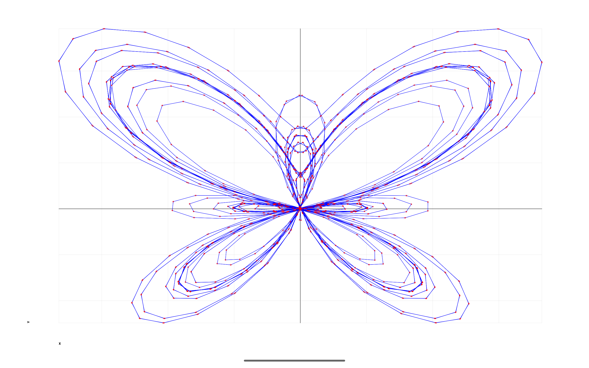
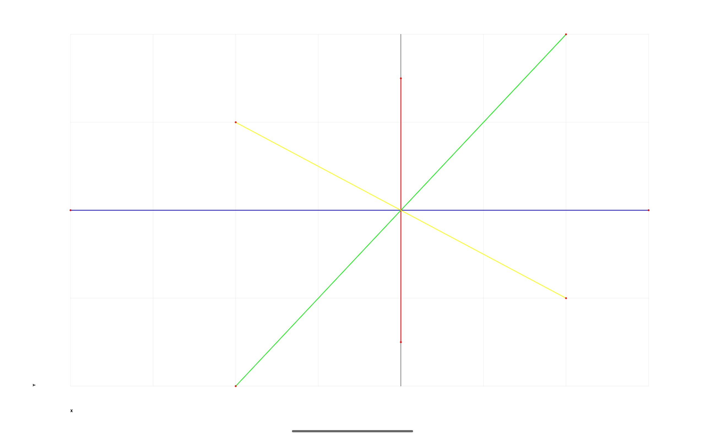
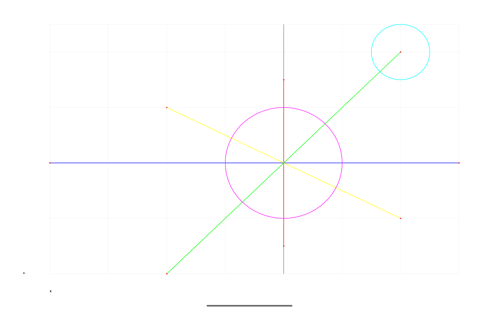
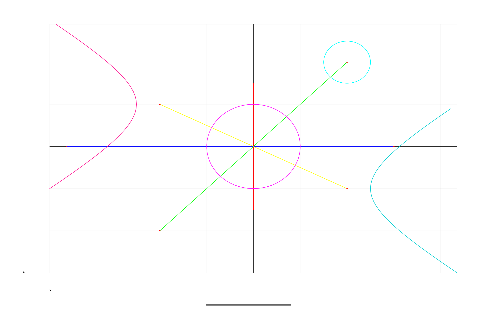

Android Graphs Experiments
==========================

Graphing experiments on Android.

Mathematics has always been fascinating, and the work of visual and recreational mathematicians is incredibly inspiring. Creators like Grant Sanderson (3Blue1Brown) and Khan Academy have played a huge role in shaping an intuitive understanding of mathematical concepts, making abstract ideas visually engaging and accessible.

Android Graph Experiments is my first pet project, which I started during my internship at my first job while learning calculus, pre-calculus, and Android development. It reflects a deep interest in mathematical visualizations and function plotting.

Features:

- Function plotting with smooth rendering.
- Support for various mathematical equations.
- A dynamic and interactive graphing experience.

Known issues [WIP]:

- Migrate to Kotlin
- Add Jetpack Compose support

---

Example: Butterfly Curve

One of the visually striking curves that can be plotted is the Butterfly Curve, defined by the parametric equations:

$$
x = \sin(t) \left(e^{\cos(t)} - 2\cos(4t) - \sin^5\left(\frac{t}{12}\right)\right)
$$

$$
y = \cos(t) \left(e^{\cos(t)} - 2\cos(4t) - \sin^5\left(\frac{t}{12}\right)\right)
$$

---

Here are few samples I plotted:

---

Tablet (10" resolution 2560x1600):

[Simple Lines Example](app/src/main/java/com/ai/engg/curves/x/y/examples/drawings/LinesCirclesCurves.kt)

[Simple Lines and Circles Example](app/src/main/java/com/ai/engg/curves/x/y/examples/drawings/LinesCirclesCurves.kt)

[Simple Lines, Circles, and Parabola Example](app/src/main/java/com/ai/engg/curves/x/y/examples/drawings/LinesCirclesCurves.kt)

---

[MIT License](/LICENSE.md)  

