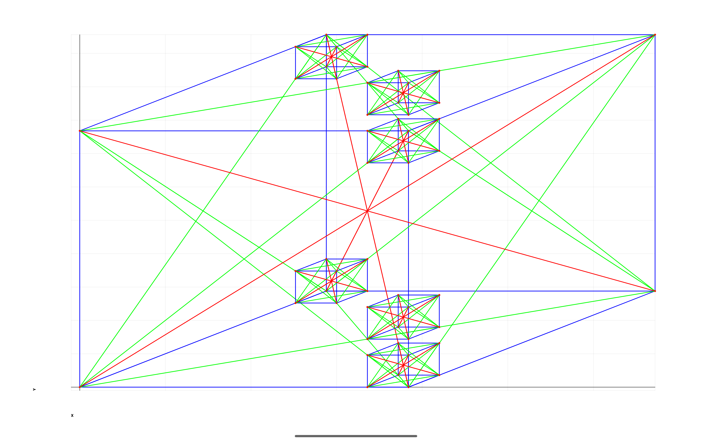

Android Graphs Experiments
==========================

Tablet (10" resolution 2560x1600):

[Assembled Box](../../app/src/main/java/com/ai/engg/curves/x/y/examples/drawings/AssembledBoxes.kt)

[Four Boxes Example](../../app/src/main/java/com/ai/engg/curves/x/y/examples/drawings/AssembledBoxes.kt)

[Two Nested Boxes Example](../../app/src/main/java/com/ai/engg/curves/x/y/examples/drawings/AssembledBoxes.kt)

[Test Boxes Example](../../app/src/main/java/com/ai/engg/curves/x/y/examples/drawings/TestExBoxes.kt)

[Four Boxes Stacked Example](../../app/src/main/java/com/ai/engg/curves/x/y/examples/drawings/FourBoxesStacked.kt)

[Eight Boxes Example](../../app/src/main/java/com/ai/engg/curves/x/y/examples/drawings/MoreBoxes.kt)

[Eight Colored Boxes Example](../../app/src/main/java/com/ai/engg/curves/x/y/examples/drawings/MoreBoxes.kt)

