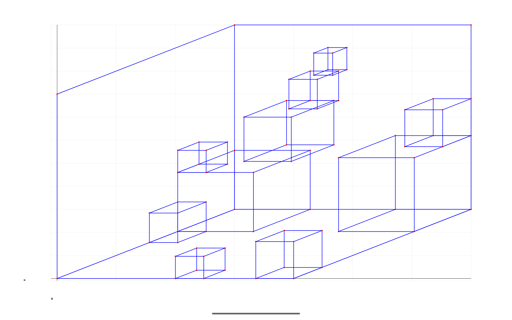
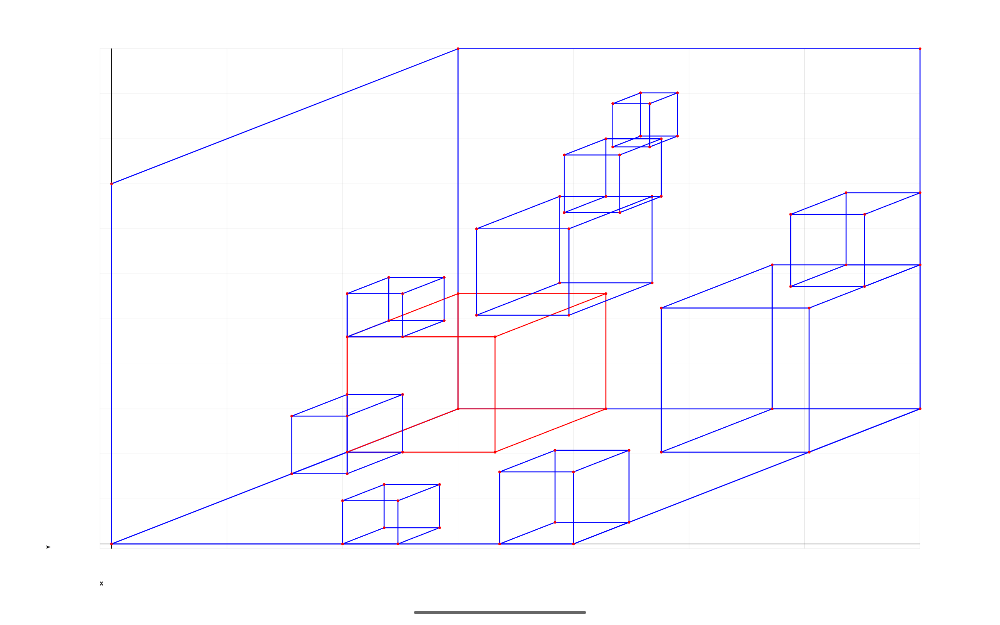
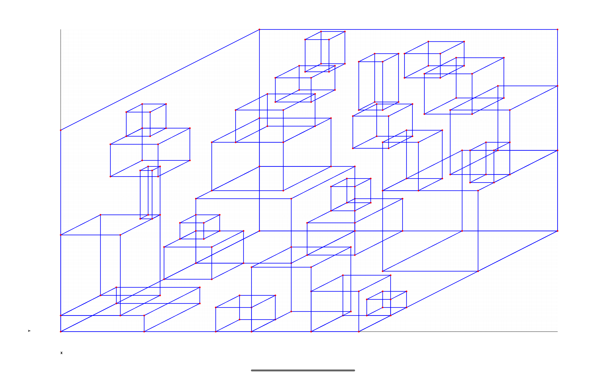
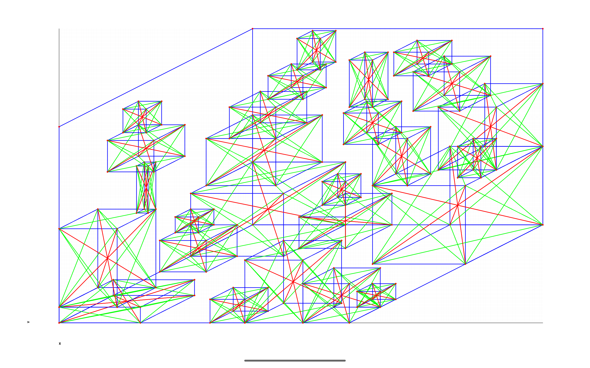

Android Graphs Experiments
==========================

Tablet (10" resolution 2560x1600):

[Simple Isometric Examples](../../app/src/main/java/com/ai/engg/curves/x/y/examples/drawings/SimpleIsometricBoxes.kt)

[Complex Isometric Examples](../../app/src/main/java/com/ai/engg/curves/x/y/examples/drawings/ComplexIsometricBoxes.kt)

