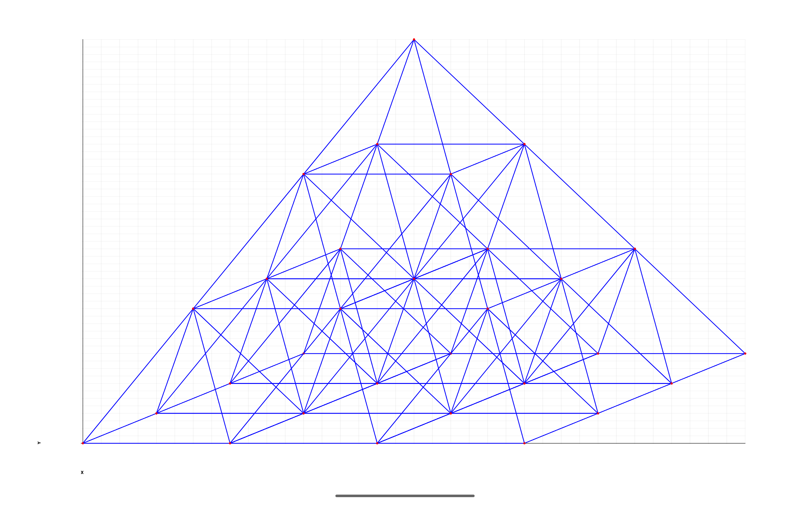

Android Graphs Experiments
==========================

Tablet (10" resolution 2560x1600):

[Simple Isometric Triangles Example](../../app/src/main/java/com/ai/engg/curves/x/y/examples/drawings/IsometricTriangles.kt)

[Filled Isometric Triangles Example](../../app/src/main/java/com/ai/engg/curves/x/y/examples/drawings/FilledIsometricTriangles.kt)

